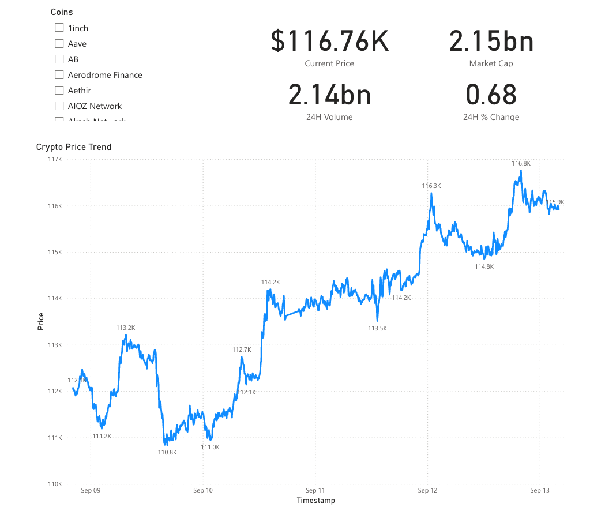
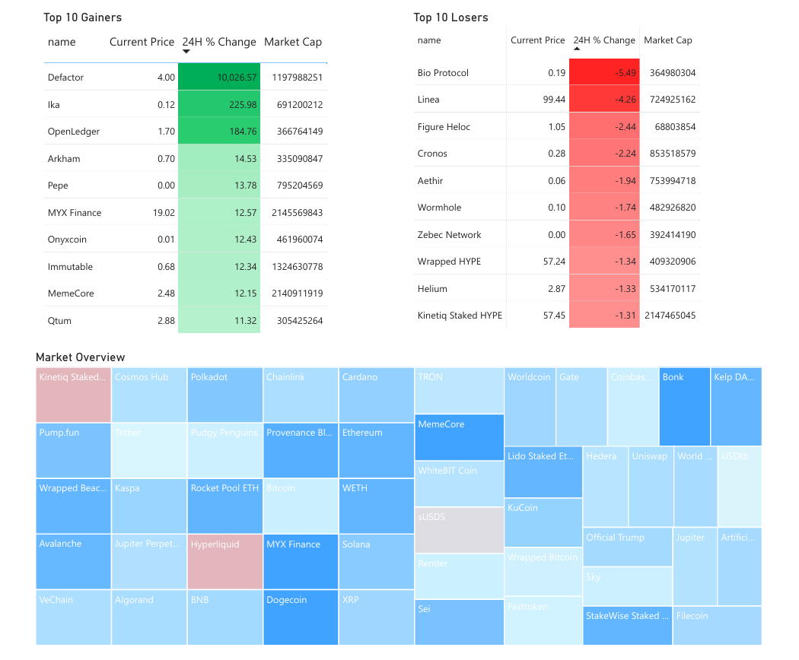
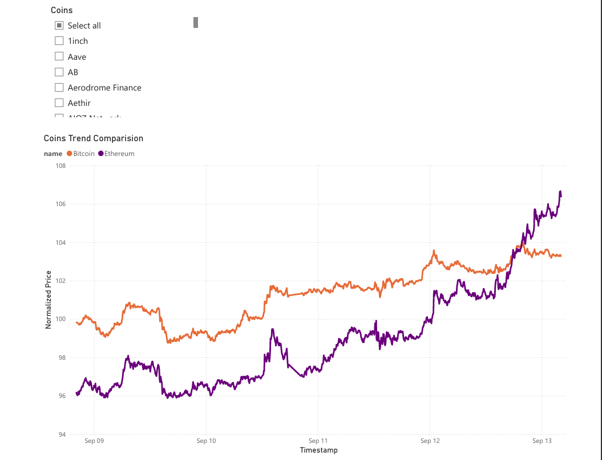

# Crypto Data Pipeline

The Crypto Data Pipeline is an end-to-end data engineering solution for collecting, transforming, and analyzing cryptocurrency market data.  
It ingests raw market data from the CoinGecko API at five-minute intervals, applies a layered transformation strategy (Bronze → Silver → Gold), and delivers curated datasets for reporting in Power BI.  

The pipeline is designed with automation, monitoring, and scalability in mind, and supports analysis across 250+ crypto assets with minimal manual intervention.  


## Architecture Overview
The pipeline follows a layered data architecture:

1. **Ingestion**
   - Source: CoinGecko public API
   - Orchestration: Azure Function (5-minute schedule)
   - Storage: Raw JSONL files with gzip compression in Azure Data Lake (Bronze)

2. **Transformation**
   - Azure Data Factory dataflows clean and standardize the raw data
   - Key operations:
     - Convert timestamps and numeric fields
     - Extract nested ROI fields
     - Handle null/invalid records gracefully
     - De-duplicate rows
     - Enrich with ingestion metadata
   - Processed outputs written as Parquet (Silver, Gold)

3. **Serving**
   - Curated Gold data stored as Parquet
   - Gold data exposed via Azure Synapse serverless SQL
   - ROI field normalized into three fields: `roi_times`, `roi_currency`, `roi_percentage`
   - Optimized for analytical consumption

4. **Visualization**
   - Power BI dashboard connected to Synapse SQL
   - Dashboard features include:
     - Single coin analysis: current price, market cap, 24h volume, 24h % change
     - Historical price trend
     - Top 10 gainers and losers by 24h % change
     - Market overview treemap (sized by market cap, colored by 24h % change)
     - Multi-coin normalized price comparison


## Features
- Automated ingestion every 5 minutes
- Storage and processing of 250+ cryptocurrency assets
- Hourly orchestration of transformation pipelines
- Robust error handling and monitoring
- Secure secret management with Azure Key Vault
- Role-based access control for all Azure components
- GitHub integration for source control and CI/CD


## Technology Stack
- **Ingestion**: Azure Functions  
- **Storage**: Azure Data Lake (Gen2)  
- **ETL & Orchestration**: Azure Data Factory (pipelines and dataflows)  
- **Serving Layer**: Azure Synapse Analytics (serverless SQL)  
- **Visualization**: Power BI  
- **DevOps**: GitHub for version control and deployment  


## Setup and Deployment

### Prerequisites
- Active Azure subscription
- Deployed resources: Function App, Data Lake, ADF, Synapse, Power BI workspace
- GitHub repository with exported configurations

### Deployment Steps
1. Clone this repository:
   ```bash
   git clone https://github.com/<your-org>/crypto-data-pipeline.git
   cd crypto-data-pipeline
2.  Deploy Azure resources manually or with infrastructure as code (ARM/Bicep).
    
3.  Import ADF pipelines and dataflows from the repository.
    
4.  Configure linked services in ADF:
    
    -   Azure Data Lake
        
    -   Azure Key Vault
        
    -   Synapse SQL
        
    -   CoinGecko API endpoint
        
5.  Store API keys and sensitive connection details in Key Vault.
    
6.  Trigger the ADF master pipeline or allow the hourly trigger to execute.
    
7.  Connect Power BI to Synapse serverless SQL and load the data model.

## Data Model

-   **Bronze Layer**: Raw JSONL data with gzip compression
    
-   **Silver Layer**: Cleaned and typed Parquet data
    
-   **Gold Layer**: Curated Parquet data, ready for analytics
    
-   **Error Handling**:
    
    -   Archive container for processed files
        
    -   DLQ container for malformed/error records
        

## Dashboard Preview

### Single-Coin Analysis


### Market Movers


### Market Overview



## Repository Contents
This repository serves as source control for the pipeline and contains:
- Azure Data Factory pipelines and dataflows
- Azure Function logic for ingestion
- Configuration files for linked services and connections
- Supporting scripts and deployment resources


## Roadmap

-   Support for incremental ingestion (change data capture)
    
-   Enhanced monitoring and alerting
    
-   Portfolio-based reporting
    
-   Automated deployment with Terraform or Bicep
